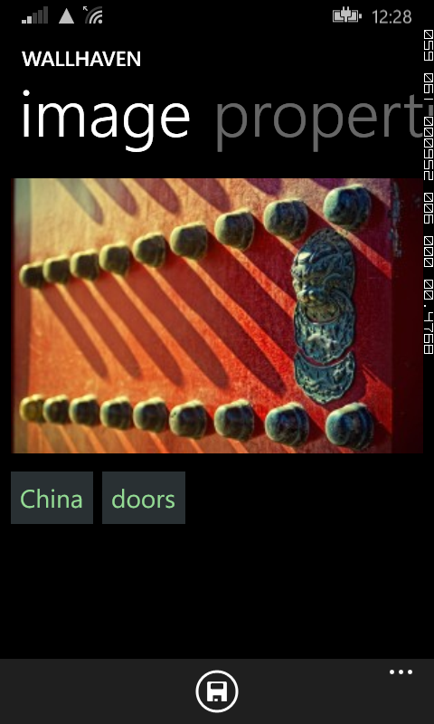
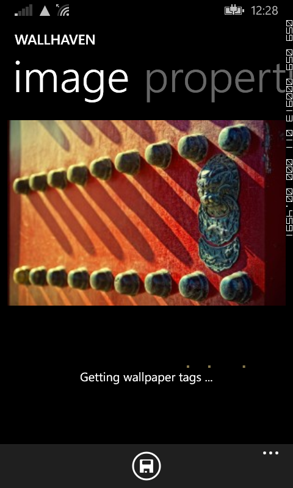
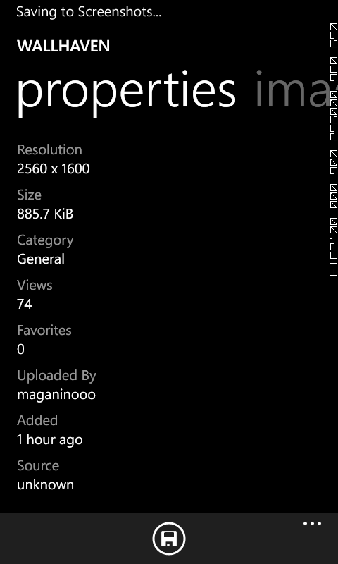
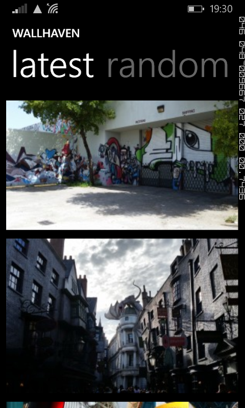
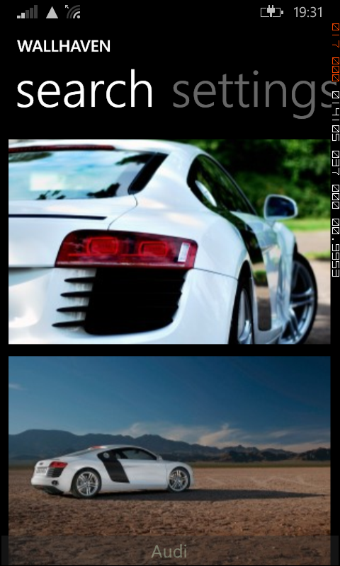
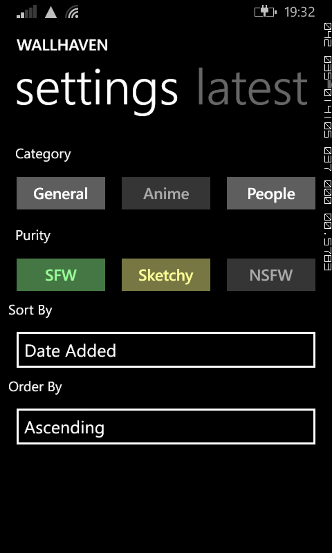

These are screenshots from an app that I was building, one that I never quite finished.

## How it all began
It was in the middle of Winter in London, I had just completed my Masters education and had a few months left before I was heading back home. 

With no relevant work experience or an impressive portfolio, I knew getting my career started would be challenging. So taking inspiration from other top programmers, I decided to build something of my own. 

At the time I was using a Lumia 520 and had recently upgraded to Windows Phone 8.1. The update supported background images on the start screen and you could see it like below. 



So I started looking for good wallpapers. As far as I knew, none of the wallpaper apps at the time on the Windows app store fetched content from [Wallhaven](http://wallhaven.cc/). I knew right then what I was going to build and it was simple enough for a first project. 

I started off by watching tutorials on Channel 9 by Bob Tabor and building two apps. After a month, I got comfortable enough that I decided to start on my project. My rough guideline to see if I was taking the app in the right direction was to see if I was building something that I would use myself. 

Since the app was fetching content exclusively from Wallhaven, I tried to match the style of the app to the styles used in the Wallhaven website as best as I could. This way users could have a familiar experience.

In around 2 months, I had completed a lot of the functionality. At this point it was capable of viewing the latest wallpapers, random wallpapers, search, customize preferences, and could download a wallpaper.

Thinking about it now, I probably had enough to release the product on to the Windows app store, but I wanted more. I guess I was trying to make it "perfect". 

In May 2015, I returned home and in another month I joined Wiinnova Software Labs Pvt Ltd. as a trainee developer.

I soon got busy with work and since I was an avid gamer at this point in my life and I convinced myself I could take the evenings and weekends to play video games. And with that I dropped working on my side project and chose to ignore any thoughts of guilt that would creep up.

I hadn't completely abandoned it at this point and I would go back occasionally and make some minor tweaks, but eventually it got to the point where I didn't work on it for months.

The projects at work required me to use Java and everything else related to front-end web development with a little bit of WordPress sometimes. I was slowly losing touch with C#, the language I had written my app in and now it's been nearly 2 years. 

When I started writing this article, I wanted to run the app again. So I installed Visual Studio, but the latest version didn't support Windows Phone 8.1 projects. Probably had to do with Windows 10 Mobile being the current OS. 

So I decided I would just keep it on GitHub for now. If you'd like to take a look you can [find it here](https://github.com/akoliyot/wallhaven). 

